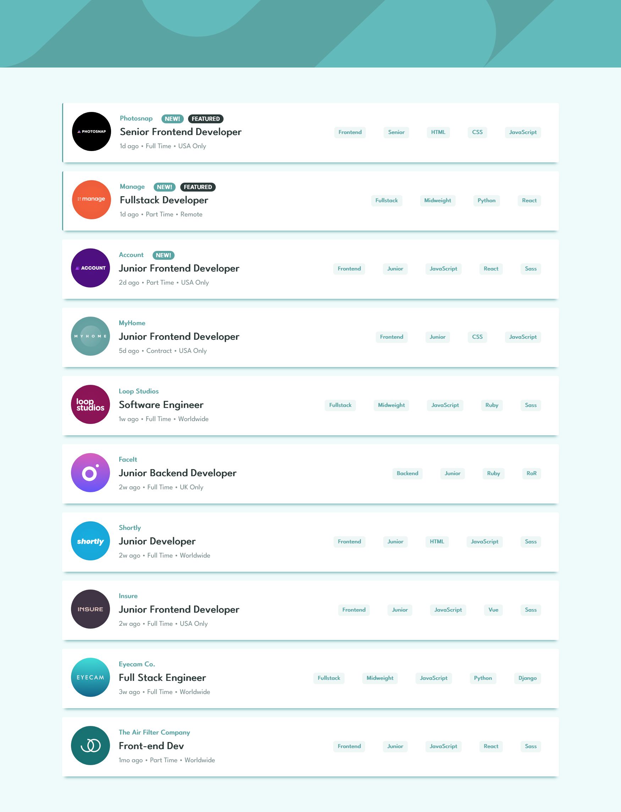
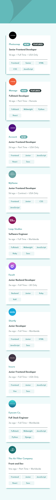

# Frontend Mentor - Job listings with filtering solution

This is a solution to the [Job listings with filtering challenge on Frontend Mentor](https://www.frontendmentor.io/challenges/job-listings-with-filtering-ivstIPCt). 

## Table of contents

- [Overview](#overview)
  - [The challenge](#the-challenge)
  - [Screenshot](#screenshot)
  - [Link](#link)
- [My process](#my-process)
  - [Built with](#built-with)
  - [What I learned](#what-i-learned)
  - [Continued development](#continued-development)
  - [Useful resources](#useful-resources)
- [Author](#author)

## Overview

### The challenge

Users should be able to:

- View the optimal layout for the site depending on their device's screen size
- See hover states for all interactive elements on the page
- Filter job listings based on the categories

Included in the challenge from front end mentor were the mockups of the finished site (everything in the design folder except the screenshots linked below), the style guide, the images in src/assets/images, and the data file in the src/assets/shared folder. 

### Screenshot

### Link

- Challenge Solution - [Job Listings](https://jeff343.github.io/frem-job-listings/)

## My process

### Built with

- CSS custom properties
- Flexbox
- CSS Grid
- [React](https://reactjs.org/) - JS library

### What I learned

Working on this project I was able to get a good understanding of handling state in a component and passing information between child and parent components. I was able to manage and update state using different data types. For the filter function I would have preferred a dropdown menu to select the filter, but I chose to follow the UI and have the filters be selected by clicking on the tabs on the job listings.

### Continued development

I plan on learning how to manage state in bigger projects using React. I would like the get a better understanding of when to use different state management such as useState vs useReducer, and how to create and pass context through the app.

### Useful resources

- [React Documentation](https://beta.reactjs.org/learn/managing-state) - This helped me decide how to manage the state of my components and how to pass information between them.

## Author

- github - [@jeff343](https://github.com/jeff343)